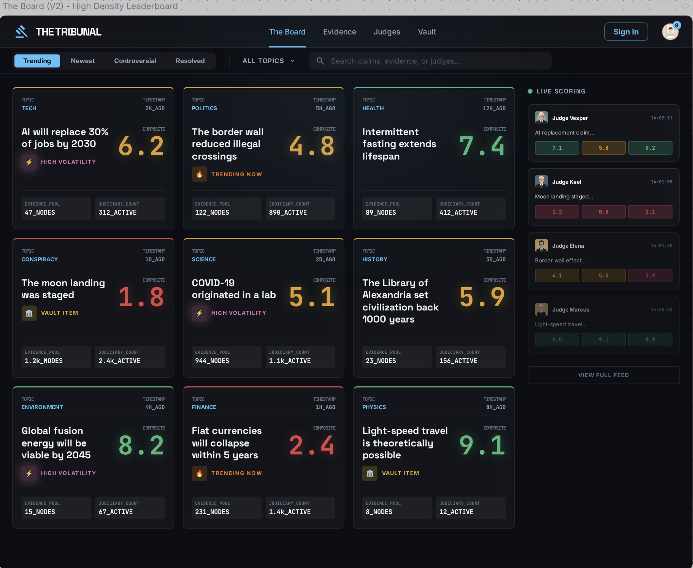

# Mockups + Build Notes

Use this page as the single source of truth for implementing V2 UI.

## Source mockups (PNG)

### 1) The Board (V2) — High Density Leaderboard

### 2) Claim Detail (V2) — Evidence Mosaics

### 3) Scoring Interface (V2) — Enhanced Precision

### 4) Live Tribunal (V4) — Broadcast Tension

### 5) Settled Claims Hall (V3) — Authoritative Archive

### 6) Judicial Profile (V2) — Prestigious Record

---

## Global build guidance (applies to every screen)

### Preserve what’s already working

- Institutional, premium dark theme that signals authority.
- “Scoring theater” feel.
- Consistent 3-number vocabulary.

### Highest-leverage fixes

1. **Make the 3 dimensions unavoidable.** In a few places they read like decoration (small bars). The mechanic is the product.
2. **Unify your controversy vocabulary.** You currently use “Volatility”, “Controversy index”, and “Biggest split”. Pick one primary word.
    - Recommendation: **Split** (memetic + visual). Use it everywhere.
3. **Strengthen the primary CTA to increase ratings volume.** Make “Judge next” and “Judge now” more aggressive.
4. **Reduce intimidation for first-time judges.** Add a single-line reassurance where appropriate: “You are scoring evidence quality, not truth.”

---

## Screen-by-screen notes (what to build / adjust)

## 1) The Board (V2)

### What works

- High density grid is scannable.
- Topic + composite + badge makes quick decisions possible.
- Right-side “Live scoring” feed is a strong spectator layer.

### Suggested changes

- Add a **Judge Queue** entry point (persistent): “3 items waiting to be judged”.
- Make **Split** visible at-a-glance:
    - Add a small “split glyph” (micro-radar, 3-dot shape, or tri-bar shape) for items flagged Split.
- Consider renaming “High volatility” → **Split: High** (or “High Split”).

### Acceptance criteria

- A new user can pick something to judge in **≤10 seconds**.
- The first action available is **Judge**, not “read more.”

---

## 2) Claim Detail (V2)

### What works

- Summary bar + controversy indicator is clean.
- Evidence feed + judge mosaics makes participation visible.
- Score history panel is great for narrative.

### Suggested changes

- Ensure the dimension labels appear consistently as **Source / Logic / Relevance** (not multiple synonyms).
- Make “Judge this” more dominant:
    - Sticky CTA on scroll.
    - Optional “Judge next evidence” flow.
- Consider a “Split highlights” subsection:
    - “Most split evidence” pinned near the top.

### Acceptance criteria

- Users understand *why* the composite is what it is (through evidence cards and split highlights).

---

## 3) Scoring Interface (V2)

### What works

- Full-screen focused ritual.
- Sliders are clear.
- Final score object is satisfying.

### Suggested changes

- Provide **fast scoring presets** (optional buttons) to reduce fiddly slider time:
    - “Strong source, weak logic”
    - “Weak source, strong logic”
    - “Highly relevant but indirect”
- Add keyboard controls for power judges.
- Consider moving the short justification into an optional “Add rationale” expandable area.

### Acceptance criteria

- Median time-to-submit for experienced judges is low.
- New judges understand anchors without reading documentation.

---

## 4) Live Tribunal (V2)

### What works

- “Now performing” + “Up next” reads like a broadcast.
- Session leaderboard builds FOMO.

### Suggested changes

- Make **Split moments** a first-class interrupt:
    - When a split is detected, show a small “Split alert” banner.
- Make “Judge this now” unstoppable:
    - Clear hotkey.
    - Timer / urgency cues.

### Acceptance criteria

- Viewers can watch without judging, but judging is always one click away.

---

## 5) Settled Claims Hall (V2)

### What works

- Archive tone is institution-grade.
- “Submit a challenge” CTA is well placed.

### Suggested changes

- Soften absolute language to reduce “truth authority” risk.
    - Replace “eternal truths” vibe with “community verdicts” / “best-available consensus (for now)”.
- Ensure **Split** is still visible historically (even settled items can show historical split).

### Acceptance criteria

- Feels like a trophy hall without implying legal-fact authority.

---

## 6) Judicial Profile (V2)

### What works

- “Consistency score”, “signature rulings”, “overturned” is compelling retention UI.
- Domain specialties are a strong identity mechanic.

### Suggested changes

- Replace “Consistency (GOD)” label with something less esoteric.
    - Recommendation: **Consistency (moving avg)** or **Consensus alignment (moving avg)**.
- Make “Signature rulings” show the **Split** story explicitly:
    - “You were early on a high-split ruling.”

### Acceptance criteria

- A judge can explain their own status in one sentence.

---

## Naming / domain integration

- Use [**tribunal.so**](http://tribunal.so) as a branded element (footer on share cards, lockup as [TRIBUNAL.so](http://TRIBUNAL.so)).
- Prefer CTA copy: **“Judge it on [tribunal.so](http://tribunal.so)”**.
- Keep URLs short and aesthetic:
    - `tribunal.so/c/<claim>`
    - `tribunal.so/e/<evidence>`

## Decisions captured (from review)

1. **Three-dimensionality is first-class.**
    - Add a micro “split triangle” glyph on Board cards (≈30×30px) that encodes shape.
        - Balanced (near-isosceles) = aligned scores.
        - Lopsided = split profile.
    - Ensure the dimension labels **Source / Logic / Relevance** appear as labeled concepts across the UI (not just tiny bars) so users learn the vocabulary passively.
2. **Standardize on “Split” everywhere.**
    - Replace: “High Volatility”, “Controversy Index”, “Biggest Split”.
    - Use a consistent scheme:
        - **Split: High / Medium / Low** (badge)
        - **Split score** (numeric, if needed)
        - **Total splits** (count)
    - Copy should support casual speech: “Did you see the split on that evidence?”
3. **Aggressive entry CTAs, ceremonial scoring act.**
    - The Board should push action: **“3 claims need your ruling”** (queue framing).
    - Claim Detail should keep a sticky **Judge this** entry point.
    - Once inside the scoring modal, keep friction and tone *weighty* (deliberate act).
4. **Safety lines are mandatory (authority + invitation).**
    - Onboarding + persistent tooltip near scoring for new judges:
        - **“You are scoring evidence quality, not truth.”**
        - **“You can’t be wrong. Disagreement is the point.”**
    - This reframes the act from “judging the claim” to “rating this piece of evidence.”
5. **Settled Claims Hall copy stance.**
    - Remove: “eternal truths”, “authoritative verdicts”.
    - Keep: **definitive**.
    - Recommended headline:
        - **“The definitive record of community rulings — scored, challenged, and preserved.”**
    - Emphasize durability via challenge counts (“challenged 47 times — held”).

## Refinements accepted (from follow-up)

1. **Claim Detail judge tiles: density first, legibility on demand.**
    - Keep the mosaic dense by default to signal crowd participation.
    - Add hover/tap expand for any tile to show the full score card.
    - Color-code dimension numbers inside tiles (no size increase required):
        - High = green
        - Low = red
        - Mid = amber
    - Goal: a 9.2 (green) next to a 2.1 (red) reads as “split” instantly.
2. **Live convention: avoid red, define a dedicated LIVE language.**
    - Red stays reserved for error/danger/low score semantics.
    - Live mode uses:
        - Accent-cyan animated edge glow
        - Dedicated **LIVE** pill (consistent placement + styling)
    - Goal: users learn the LIVE convention once and recognize it forever.
3. **Scoring radar: treat it as the receipt (payoff), not the preview (distraction).**
    - Pre-submit: keep radar small/subtle while sliders are the primary action.
    - Post-submit reveal: radar expands into the hero position alongside the average.
    - Suggested animation path:
        - Sliders fade
        - Radar expands to center
        - Score card flips in

## Open questions for implementation

- Where should the **Judge Queue** live (Board header vs floating button vs sidebar)?
- Should justification be optional everywhere, or required only for Senior+ / Live sessions?
- Do we want “Split” to be purely categorical (High/Med/Low) or also numeric (Split score)?